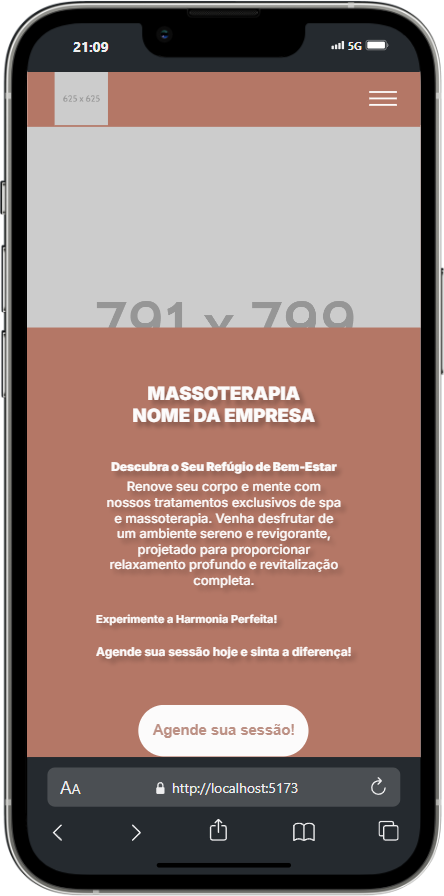

# Landing Page para um Spa de Massoterapia

Este é o repositório de um projeto meu e... Podemos dizer que um quase trabalho freela. Feito em REACT, JS, HTML e CSS

## Índice

- [Visão geral](#visão-geral)
   - [O projeto](#o-projeto)
   - [Captura de tela](#captura-de-tela)
- [Meu processo](#meu-processo)
   - [Construído com](#construído-com)
   - [O que aprendi](#o-que-aprendi)
- [Autor](#autor)

## Visão geral

### O projeto

Essa landing page foi feita para um Spa de Massoterapia. Landing page totalmente responsiva para todos os tipos de dispositivos com desing unico e original criado por mim mesmo.
O usuario deve ser capaz de: 
- Interagir com varios elementos da tela
- Pode ser redirecionado para alguma rede social da empresa dependendo do em qual botão é clicado 
- Com apenas um clique é capaz de agendar uma sessão via Whatsapp
- Pode ser preenchido um formulario para ser feito o agendamento da sessão via Whatsapp ou Email

### Captura de tela

### DESKTOP


### TABLET


### MOBILE



## Meu processo

### Tecnologias Utilizadas

- React e React Hooks: Utilizei o framework React e sua biblioteca React Hooks para construir uma interface para o usuário leve e rapida.

- Metodos, exportamento e importamneto de funções e componentes em JavaScript e React para a interação


### O que eu aprendi

APRENDI CAMINHAR COM AS PROPRIAS PERNAS! Por se tratar de um trabalho freelancer foi solicitado algo unico, então tudo foi criado por mim, tive certos desafios como por exemplo o gradiente que é feito nos cards que pode ser visto nas seções de Serviços e Beneficios ou até mesmo a animação ao rolar a tela, tecnicas de UI/UX, tecnicas de marketing... Responsividade, ler documentações, pesquisar e resolver problemas sozinho e versionamento Git.

- ANIMAÇÃO DE AO ROLAR A TELA FOI FEITA POR MEIO DE UMA API INTERNA DO JS CHAMADA "Intersection Obrserver"
https://developer.mozilla.org/en-US/docs/Web/API/Intersection_Observer_API

```js
function Animation(elementos) {
    const myObserve = new IntersectionObserver((entries) => {
        entries.forEach((entry) => {
            if (entry.isIntersecting) {
                entry.target.classList.add('show')
            } else {
                entry.target.classList.remove('show')
            }
        });
    })

    elementos.forEach((element) => {
        myObserve.observe(element)
    });
}

export default  Animation  
```
- A IMPORTAÇÃO DESSA FUNÇÃO É FEITA EM TODAS AS PAGINAS QUE EU QUERO COLOCAR A ANIMAÇÃO, EXEMPLO: *A IMPORTÇÃO FOI FEITA NA PAGINA HOME*

```jsx
import '../style/animation.css'
import Animation from '../animation'

import { useEffect } from 'react'

const Home = () => {
    
  useEffect(() => {
    const show = document.querySelectorAll('.hidden')
    Animation(show)
  }, [])

  return...
```

## NOTA:

- NOTA: Como se trata de um trabalho freelancer eu decide manter em anonimo para qual empresa foi feito o projeto já que ele não chegou de fato ser finalizado faltando ser finalizado apenas o envio do formulario que ao fazer o envio ele vai para lugar nenhum e a seção Sobre e Depoimentos... Como cliente desistiu quase no fim do projeto ficou faltando apenas esse final, quem sabe mais para frente eu finalizo essa parte

## Autor

- Linkedin - [Luis Fernando Macedo](https://www.linkedin.com/in/luis-fernando-macedo-7791ba219)
- Instagram - [Luis Fernando](https://www.instagram.com/luis._.fernand0_)